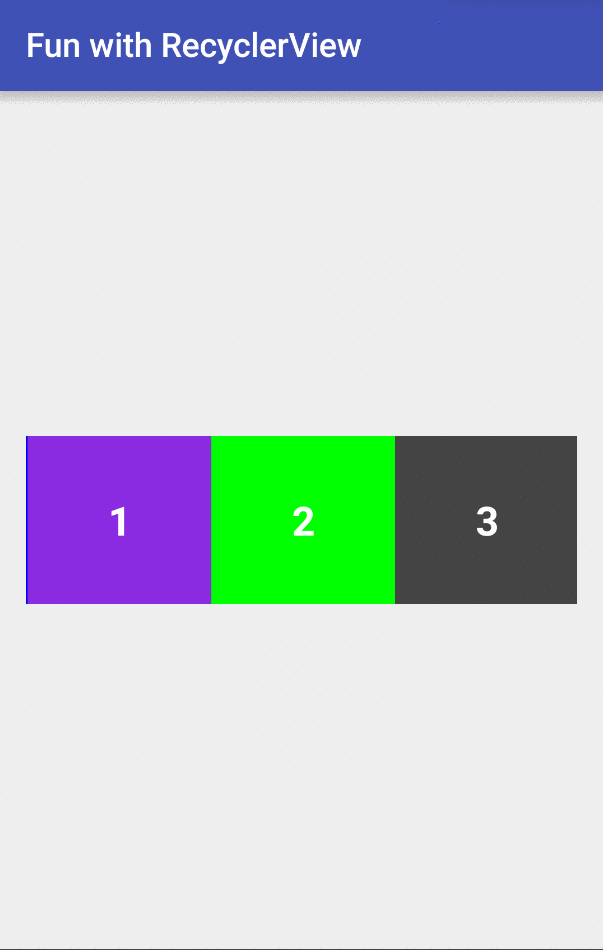
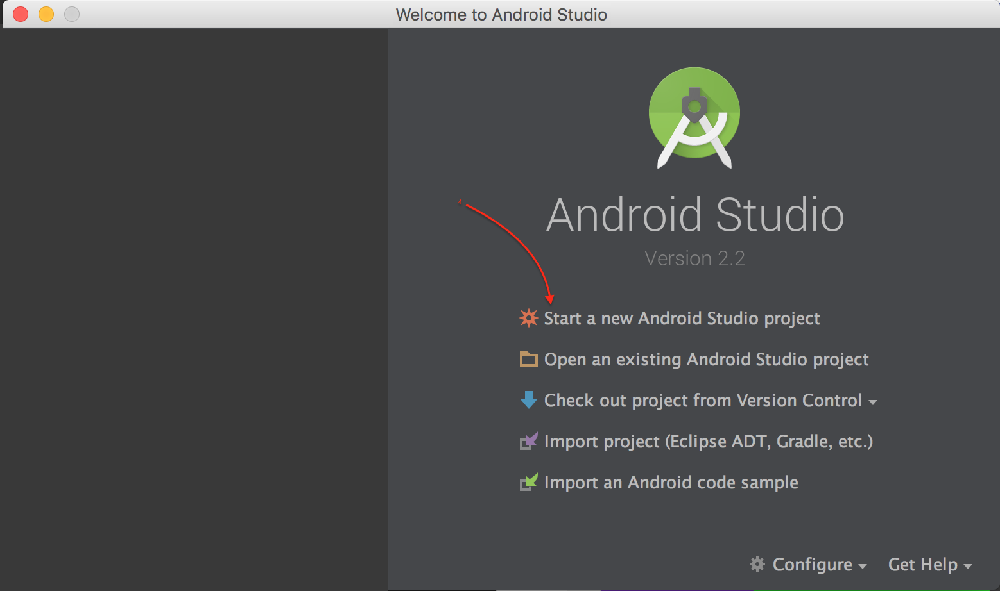
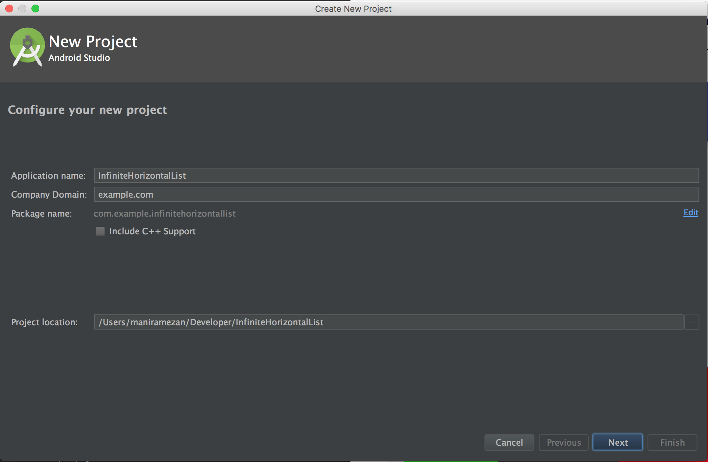
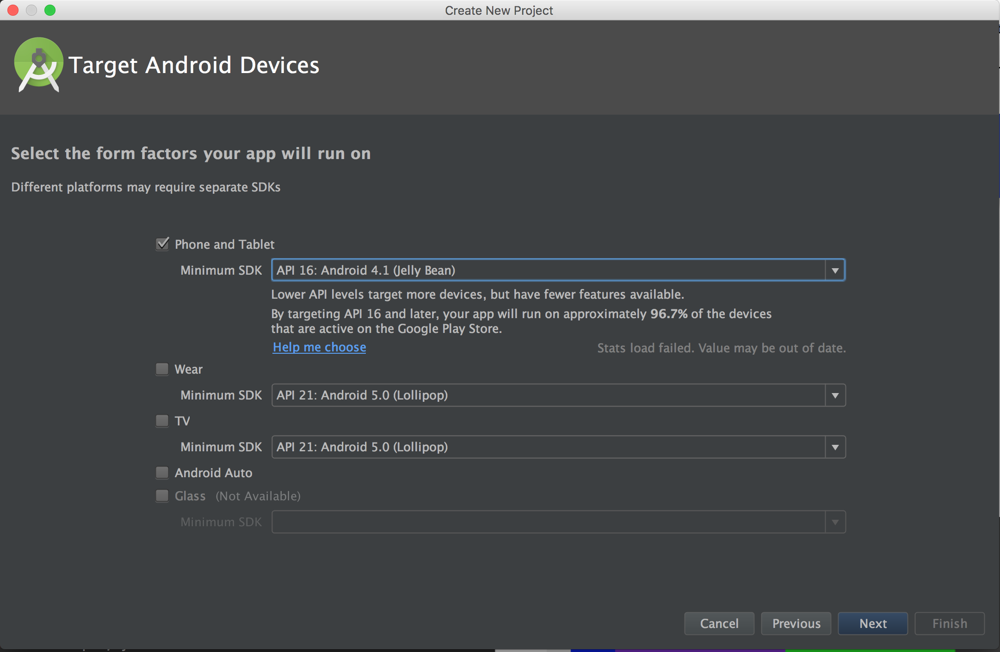
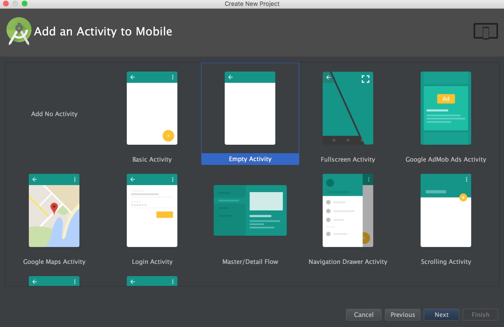
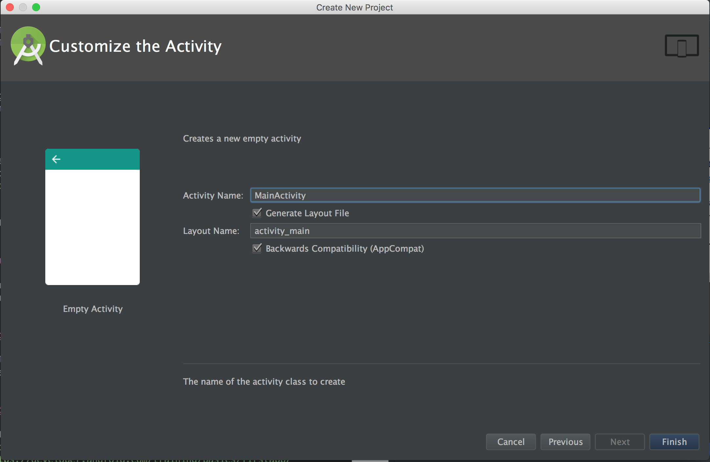

# One-Direction Infinite Horizontal List

This is part 1 out of 2 part tutorial explaining how to create a bi-directional infinite horizontal list that shows constant number of items. In this part, we will go over creating an infinite one-direction horizontal list. We will start by creating an Android project from scratch and go through the steps for customizing the project and start using [RecyclerView](https://developer.android.com/reference/android/support/v7/widget/RecyclerView.html) to create our horizontal scrollable list. Following image shows the final result:

You can also find the source code for this part on [Github]().

In part 2, we will expand our example to make it a bi-directional list. This tutorial and the next one are designed and explained with consideration that the audience doesn't have much experience in implementing code for Android and not much familiar with Android Studio. Also note that the steps and screenshots are from Android Studio on Mac OS X, so the buttons and items might be in a different place if you're using Linux or Windows.

### What you will learn
* How to create a project in Android Studio
* How to decide about minimum and targeted API level
* How to use RecyclerView to create a horizontal scrollable list
* Some tricks and shortcuts for Android Studio

### What you expected to know already
Some familiarity with Java or C# would help to go through this sample and understand the codes. There's no any complex or advance usage of Java in this sample so as long as you have some basic knowledge, you will be fine. The main focus is Android Studio features and Android SDK.

### Setup the project
This step is creating a new Android Studio project. If you already know how to do it, you can skip this part. In addition, you can follow steps on Android website for [Create a Project](https://developer.android.com/studio/projects/create-project.html). I also have included steps with screenshots in this section.

Lets start with creating a project in Android Studio. For this, you need to open Android Studio on you and click on "Start a new Android Studio project". 

The next step is configuring your project, information like application name, the company domain, and the location that the project folder is created. For this example, you can fill them as follow and click on next:

The next page in the wizard is where you can select your targeted Android platforms and API levels for each. For this sample, we choose only "Phone and Tablet" and set the minimum SDK to be `API 16: Android 4.1 (Jelly Bean)`

For deciding which API level to choose and how that would affect the number of users that can use your app, you can either check out the dashboard on [Android webpage](https://developer.android.com/about/dashboards/index.html) or you check [Android Dashboard](https://developer.android.com/training/basics/firstapp/creating-project.html) website. Just notice that this information is based on phones that access Google Play store and it doesn't include devices that use only [Amazon app store](https://www.amazon.com/mobile-apps/b?ie=UTF8&node=2350149011).

> This data reflects devices running the latest Google Play Store app, which is compatible with Android 2.2 and higher. Each snapshot of data represents all the devices that visited the Google Play Store in the prior 7 days.

The next step is the screen on which you choose which activity to include in your app by default. For this example, we would only need an `Empty Activity`

The next screen is for customizing your activity, things like activity name, layout name, and if it needs to be backward compatible or not.

After clicking on `Finish`

https://realm.io/news/360andev-yigit-boyar-pro-recyclerview-android-ui-java/