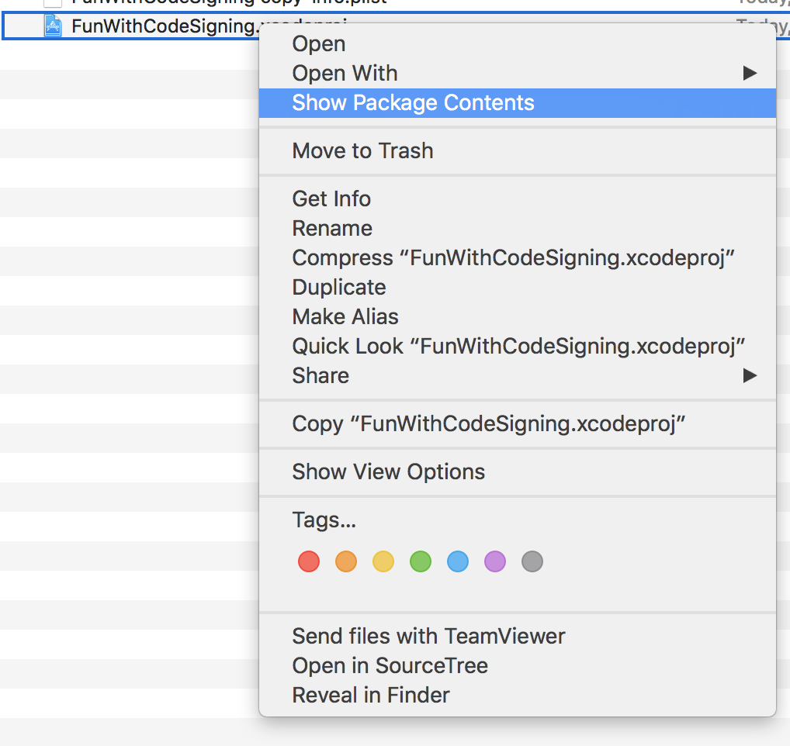
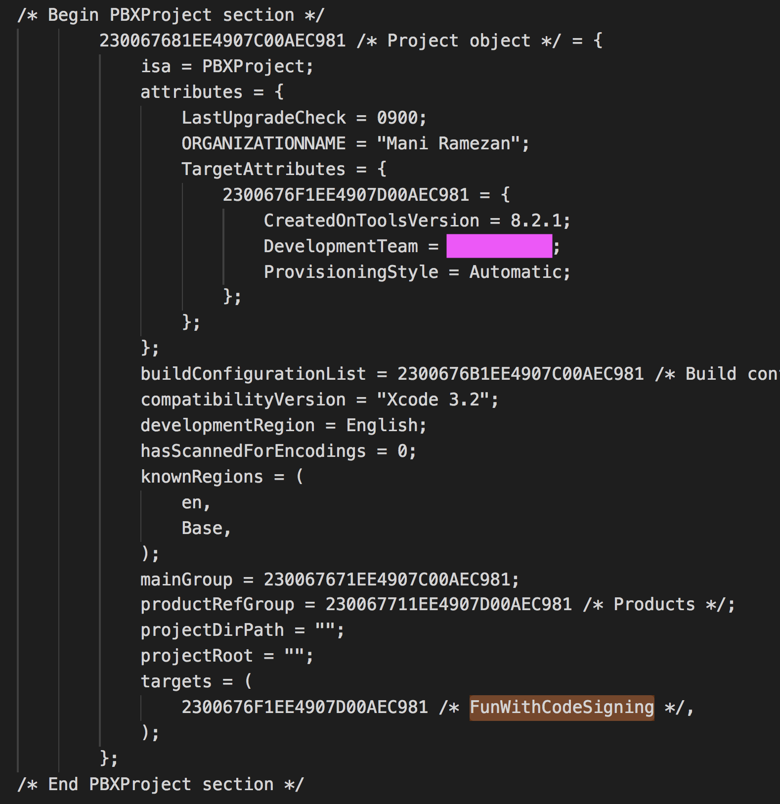
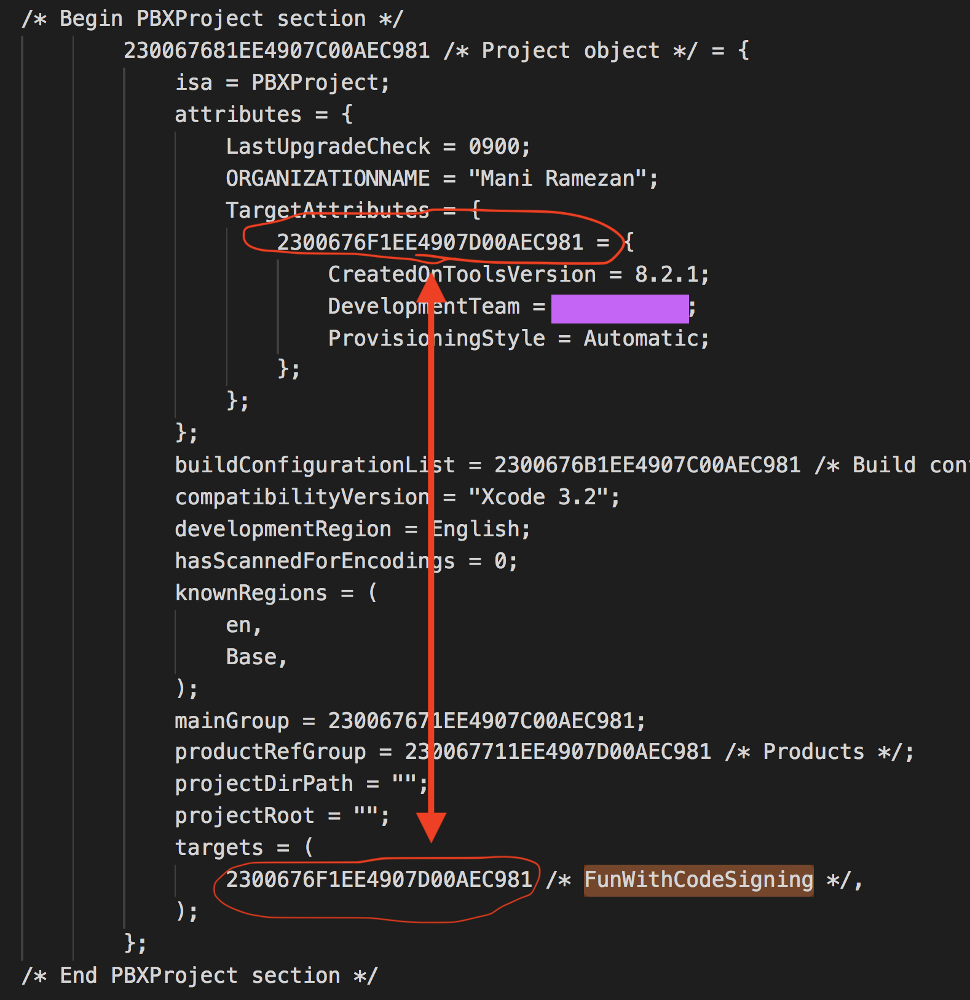
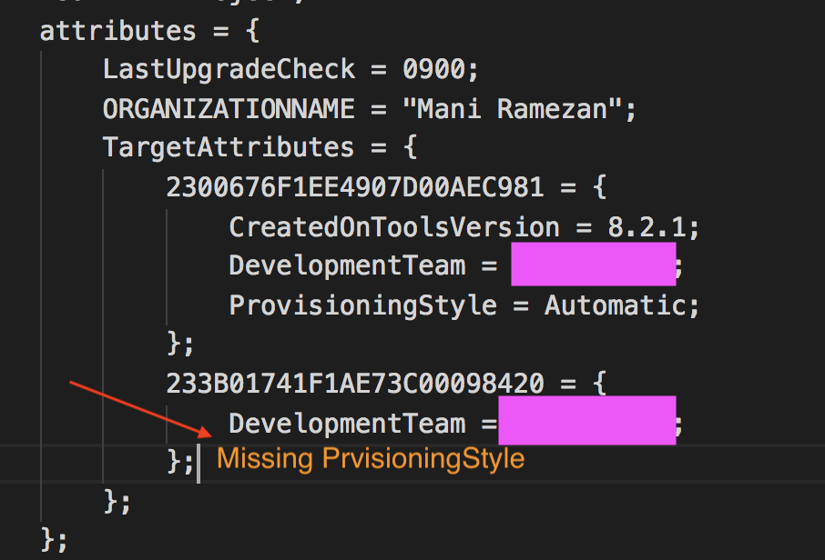
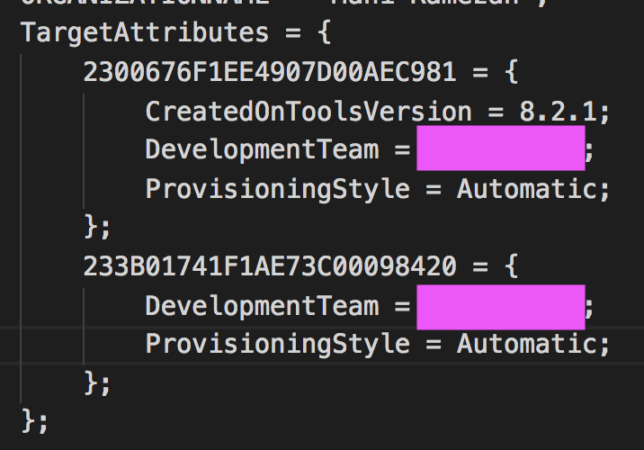

# Fun with Code Signing in Xcode 8

Apple introduced automatic code signing feature in Xcode 8. This was intended to fix many issues that developers had previously on managing certificates and provisioning applications in addition to make it much easier to sign applications and make capabilities in the app and developer portal in sync. There is a whole session on this topic in WWDC 2016, [What's New in Xcode App Signing](https://developer.apple.com/videos/play/wwdc2016/401/). This feature helps to save lots of time on certificate management to provisioning applications. However, since the automatic code signing feature started using Development certificate for archiving the app, this broke most of build scripts. As it's discussed in [this answer](https://stackoverflow.com/a/39598052/1450348), there are several workarounds for it. In this post, we will look into how to switch to manual code signing in build script for a scenario that you’d need to use a separate certificate in your build scripts.

### That moment that you update to Xcode 8
With all the greatness of automatic code signing, it also brought some harm with it. One of the main issues with automatic code signing is when your CI script needs to override `CODE_SIGN_IDENTITY` to build the app with different certificates for different teams, e.i Enterprise and App Store. Probably, your build script looks like something like:

```
xcodebuild -project MyAmazingApp.xcodeproj -target MyTarget clean archive -sdk iphoneos PRODUCT_BUNDLE_IDENTIFIER=edu.myamazingcompany.myamazingapp -archivePath MyArchive.xcarchive PROVISIONING_PROFILE_SPECIFIER={Provisioning_Profile_Uuid} CODE_SIGN_IDENTITY="Your_Code_Signing_Identity"
```

Running which gives you following error in Xcode 8:

> Check dependencies
> 
> {Target / Scheme} has conflicting provisioning settings. {Target / Scheme} is automatically signed for development, but a conflicting code signing identity iPhone Distribution has been manually specified. Set the code signing identity value to "iPhone Developer" in the build settings editor, or switch to manual signing in the project editor.
> 
> Code signing is required for product type 'Application' in SDK 'iOS 10.X'

If you're not familiar with `xcodebuild` command, you can learn about it by running: `xcodebuild -help` or checking Apple documentation page on [xcodebuild](https://developer.apple.com/legacy/library/documentation/Darwin/Reference/ManPages/man1/xcodebuild.1.html).

As mentioned before, there are several workarounds for this issue. Here, we'll look into how to leave Automatic Code Signing feature on in the project and just disable it before calling `xcodebuild` command so we can still specify code signing certificate manually and override the default.

### Let's disable that automatic code signing
First, let's see how Xcode indicates if a target is set using automatic code signing. As it's discussed [here](https://stackoverflow.com/questions/37806538/code-signing-is-required-for-product-type-application-in-sdk-ios-10-0-stic), `ProvisioningStyle` is the attribute name that identifies if a target should use automatic code signing or not depends on its value, `Atuomatic` / `Manual`.

For seeing this in your project, first need to right click on your project file and choose `Show Package Contents`:



The file that we're intersted in is named `project.pbxproj`. This file holds the information about your project and targets. Go ahead and open this file in your favorite text editor. The portion that we are interested in can be found by searching for `Begin PBXProject section`. 



This portion saves  information about your targets and some attributes about your targets. All targets defined in the project are listed under `targets` with a comment in front of them to mention which one is which. Each target is referenced by its [UUID](https://en.wikipedia.org/wiki/Universally_unique_identifier):



You can find more information on `pbxproj` structure and what each portion of the file is at [this link](http://danwright.info/blog/2010/10/xcode-pbxproject-files/).

As illustrated above, you can find your target UUID under targets and by that, find attributes assigned to your target under `TargetAttributes`. One of the attributes that's saved under there is the `DevelopmentTeam` ID, your apple team ID, and `ProvisioningStyle` which indicates code signing mode, `Automatic` / `Manual`. Now, you see where the above error is coming from:

> This portion of `pbxproj` file is needed to be also replaced with your apple team ID and the provisioning profile to change from `Automatic` to `Manual`.

The reason is the overriding portion of `xcodebuild` command that changes `CODE_SIGN_IDENTITY` and `PROVISIONING_PROFILE_SPECIFIER`, it conflicts with what is set in `pbxproj` since the team ID set in `DevelopmentTeam` doesn't have the new code sign certificate.

For fixing this, you’d need to update `DevelopmentTeam` to an empty string as recommended by Apple and change `ProvisioningStyle` to `Manual`.

Now, time to put all these into a script to do the job:

```
sed -i '' 's/ProvisioningStyle = Automatic;/ProvisioningStyle = Manual;/' MyProj.xcodeproj/project.pbxproj
sed -i '' "s/DevelopmentTeam = ${DevelopmentTeamID};/DevelopmentTeam = \"\";/" MyProj.xcodeproj/project.pbxproj
sed -i '' "s/DEVELOPMENT_TEAM = ${DevelopmentTeamID};/DEVELOPMENT_TEAM = \"${TEAM_ID}\";/" MyProj.xcodeproj/project.pbxproj
```

Notice that in the automation, there's a script to replace `DEVELOPMENT_TEAM` value also. This part also needs to be replaced with the right team ID. This can be done either as part of `xcodebuild` command or through this script. The former doesn't work if your project has other projects as its dependencies:

```
xcodebuild -project MyAmazingApp.xcodeproj -target MyTarget clean archive -sdk iphoneos PRODUCT_BUNDLE_IDENTIFIER=edu.myamazingcompany.myamazingapp -archivePath MyArchive.xcarchive PROVISIONING_PROFILE_SPECIFIER={Provisioning_Profile_Uuid} CODE_SIGN_IDENTITY="Your_Code_Signing_Identity"
```

One final trick to this approach is when you add a new target to the project under Xcode 8 or later. By default, Xcode doesn't put the portion for `ProvisioningStyle = Automatic;` there:



In this case, you'd need to add it manually for each target that you create:



### Summary
Dealing with code signing and sharing certificates across multiple devices are now all done automatically and supported in Xcode 8 through automatic code signing feature. In addition, now, Xcode gives some useful errors / warnings about your app signing and provisioning issues. However, this approach, broke many build scripts that were relying on switching team ID and using different certificates and provisioning profiles. In this post, one approach to deal with this issue was reviewed and explained.