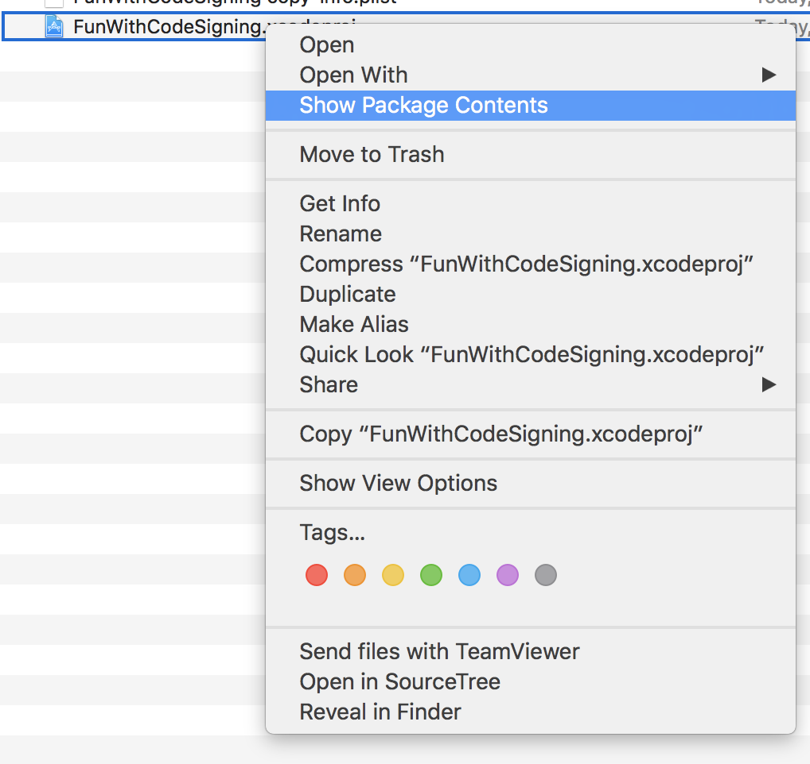
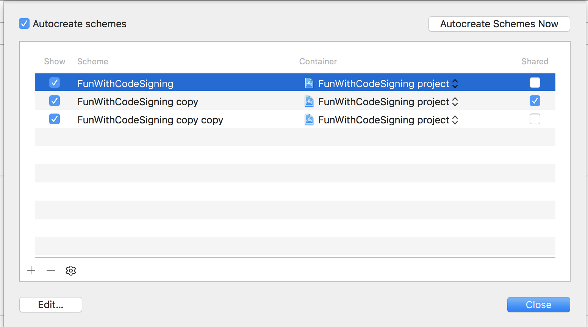
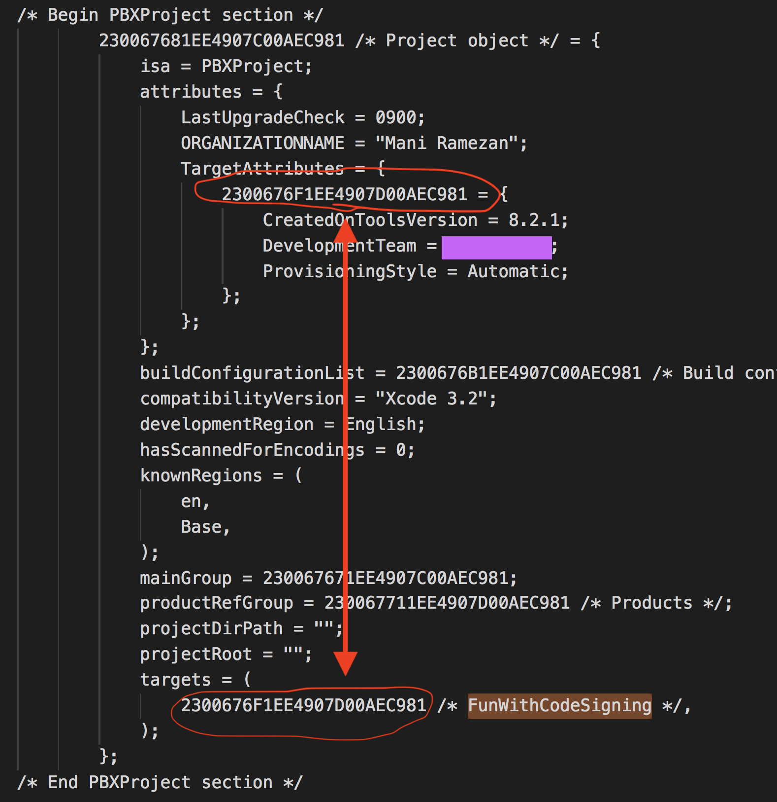
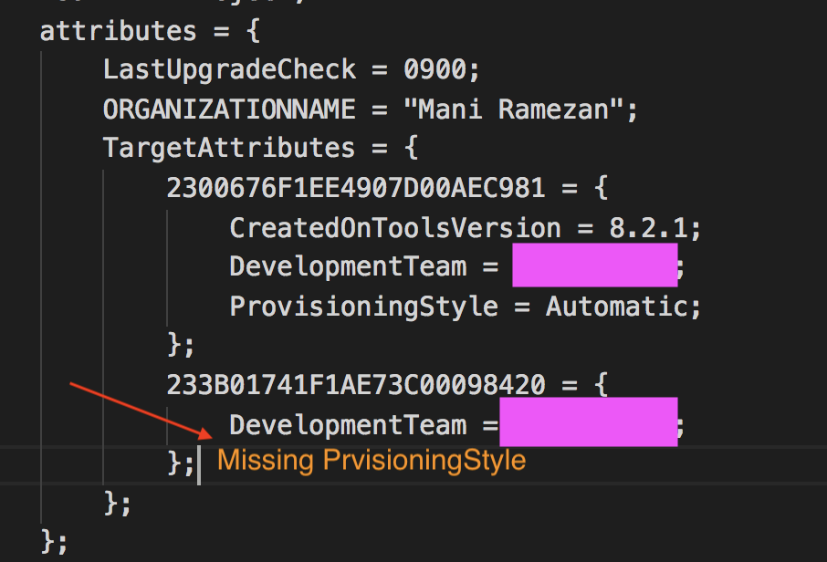
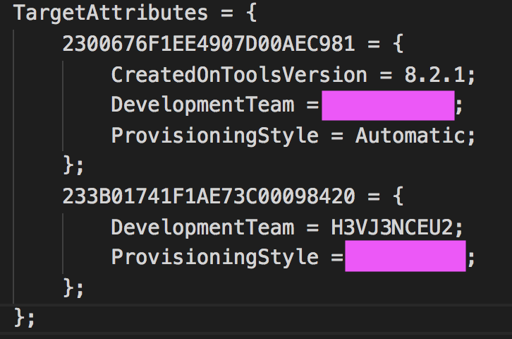

# Manual Code Signing

As part of Xcode 8 features, Apple introduced automatically code signing during and there's a whole session on in WWDC 2016, [What's New in Xcode App Signing](https://developer.apple.com/videos/play/wwdc2016/401/). There were several issues due to code signing and provisioning the application before Xcode 8 and the error messages mostly weren't much useful to narrow down the issue. I remember there were many times that I could even successfully make a build of my application, but it was crashing right on the start up and after spending hours over it, it was due to some entitlement mismatch issues. Many of these issues are resolved in Xcode 8 with better error messages and also automating many of the steps. All of these new features work great and if you're managing a CI build, as far as you're not overriding the default bundle identifier, this shouldn't affect your build script. However, if you do use overriding bundle identifiers based on the build requested (enterprise vs. App store) then your build script starts failing on Xcode 8. This post is about the solution I found for this issue that worked for ours and hopefully it helps another person to save some time if they've having similar issue.

### Everything was working fine until I needed to override the bundle ID
With all the greatness of automatic code signing, it also brought some harm with it. One of the main issues with automatic code signing is when your CI script for some reason (supporting both Enterprise / AppStore builds) needs to override Bundle ID which results in overriding probably the code signing certificate and provisioning profile. For that, you'd probably running a script as follow:

```
xcodebuild -project MyAmazingApp.xcodeproj -target MyTarget clean archive -sdk iphoneos PRODUCT_BUNDLE_IDENTIFIER=edu.myamazingcompany.myamazingapp -archivePath MyArchive.xcarchive PROVISIONING_PROFILE_SPECIFIER={Provisioning_Profile_Uuid} CODE_SIGN_IDENTITY="Your_Code_Signing_Identity"
```
> Check dependencies
> 
> {Target / Scheme} has conflicting provisioning settings. {Target / Scheme} is automatically signed for development, but a conflicting code signing identity iPhone Distribution has been manually specified. Set the code signing identity value to "iPhone Developer" in the build settings editor, or switch to manual signing in the project editor.
> 
> Code signing is required for product type 'Application' in SDK 'iOS 10.X'

If you're not familiar with `xcodebuild` command, you can learn more about possible arguments by running: `xcodebuild -help` or checking Apple documentation page on [xcodebuild](TODO:) command.

If you also looking for documentation on `xcconfig` and how to extract current configuration or what are the possibile variables that you can override, e.i. `CODE_SIGN_IDENTITY`, please check [this project](TODO:) on github.

For solving this, you'd need to either move to manual code signing and abandon the whole greatness of automatic code signing and time savings that come with it, or change your build script to disable it before calling `xcodebuild`. The latter one is what we're gonna go through here.

### Let's disable that automatic code signing
First, let's look at how Xcode indicates if one project is set for automatic code signing or not. As it's discussed [here](https://stackoverflow.com/questions/37806538/code-signing-is-required-for-product-type-application-in-sdk-ios-10-0-stic). You can right click on your project file and choose `Show Package Contents`



You see `project.pbxproj` file with `project.xcworkspace` file and a folder named `xcuserdata` which contains some information for your Xcode to remember the settings and also it holds the schemes you have defined. You would also see a folder named `xcshareddata` if you had chosen any of your sheme to be shared under scheme management:




Now, if you open `project.pbxproj` file with your choice of text editor, this file shows the information about your project and targets. The portion that we're interested in can be found by searching for name of your project, or searching for the word `targets`:



As shown, when you search for either you project name or `targets` word, it takes you to a portion of the file where you see information about the project itself. If you have multiple targets, it'll show them all under `targets` with a comment in front of them to mention which one is which. Each target is assigned known by its [UUID](https://en.wikipedia.org/wiki/Universally_unique_identifier). If you're interested more on knowing `pbxproj` structure, you can read more on it [here](http://danwright.info/blog/2010/10/xcode-pbxproject-files/).

By now, you have the UUID of your target by which, you can find your target settings under `TargetAttributes`. One of the attributes that's saved under `TargetAttributes` for each target, is the `DevelopmentTeam` ID which is a 10-alphanumeric ID related to the apple account set for code signing and an attribute called `ProvisioningStyle` which indicates code signing mode, `Automatic`/`Manual`. Now, you see where the above error is coming from:

> This portion of `pbxproj` file is needed to be also replaced with your apple team ID and the provisioning profile to change from `Automatic` to `Manual`. 

Because in our script, we're overriding `CODE_SIGN_IDENTITY`, `PROVISIONING_PROFILE_SPECIFIER`, and `DEVELOPMENT_TEAM`, it conflicts with what is set in `pbxproj` since team ID is different between `DEVELOPMENT_TEAM` and `DevelopmentTeam`. All needs to be done is also changing value of `DevelopmentTeam` in `project.pbxproj`. 

Get all these together, following command lines do the trick:

```
sed -i '' 's/ProvisioningStyle = Automatic;/ProvisioningStyle = Manual;/' MyProj.xcodeproj/project.pbxproj
sed -i '' "s/DevelopmentTeam = ${DevelopmentTeamID};/DevelopmentTeam = \"\";/" MyProj.xcodeproj/project.pbxproj
```

And the only thing that needs to change in your `xcodebuild` command is overriding `DEVELOPMENT_TEAM` value to empty string also, as it's recommended in [What's New in Xcode App Signing](https://developer.apple.com/videos/play/wwdc2016/401/).

```
xcodebuild -project MyAmazingApp.xcodeproj -target MyTarget clean archive -sdk iphoneos PRODUCT_BUNDLE_IDENTIFIER=edu.myamazingcompany.myamazingapp -archivePath MyArchive.xcarchive PROVISIONING_PROFILE_SPECIFIER={Provisioning_Profile_Uuid} CODE_SIGN_IDENTITY="Your_Code_Signing_Identity"
```
    
The only trick to this approach is when you add a new target that you create on Xcode 8 and later. By default, Xcode doesn't put the portion for `ProvisioningStyle` there:



In this case, you'd need to add it manually for each target that you create:



