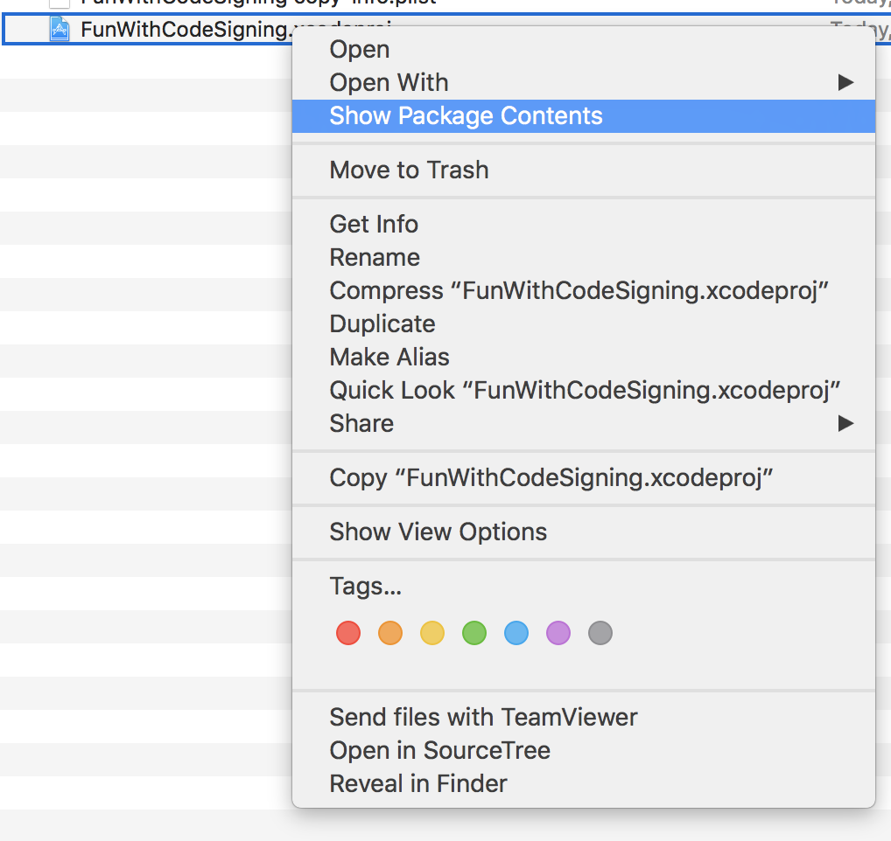

# Manually Signing the Application for CI Builds

As part of Xcode 8 features, Apple introduced automatically code signing during and there's a whole [WWDC session](https://developer.apple.com/videos/play/wwdc2016/401/) about it. There were several issues due to code signing and provisioning the application before Xcode 8 and the error messages mostly weren't much useful to narrow down the issue. I remember there were many times that I could even successfully make a build of my application, but it was crashing right on the start up and after spending hours over it, it was due to some entitlement mismatch issues. Many of these issues are resolved in Xcode 8 with better error messages and also automating many of the steps. All of these new features work great and if you're managing a CI build, as far as you're not overriding the default bundle identifier, this shouldn't affect your build script. However, if you do use overriding bundle identifiers based on the build requested (enterprise vs. App store) then your build script starts failing on Xcode 8. This post is about the solution I found for this issue that worked for ours and hopefully it helps another person to save some time if they've having similar issue.

### Everything was working fine until I needed to override the bundle ID
With all the greatness of automatic code signing, it also brought some harm with it. One of the main issues with automatic code signing is when your CI script for some reason (supporting both Enterprise / AppStore builds) needs to override Bundle ID. Errors like:

    xcodebuild -project MyAmazingApp.xcodeproj -target MyTarget clean archive -sdk iphoneos PRODUCT_BUNDLE_IDENTIFIER=edu.myamazingcompany.myamazingapp -archivePath MyArchive.xcarchive DEVELOPMENT_TEAM='' PROVISIONING_PROFILE_SPECIFIER={Provisioning_Profile_Uuid} CODE_SIGN_IDENTITY="Your_Code_Signing_Identity"

> Check dependencies
> 
> {Target / Scheme} has conflicting provisioning settings. {Target / Scheme} is automatically signed for development, but a conflicting code signing identity iPhone Distribution has been manually specified. Set the code signing identity value to "iPhone Developer" in the build settings editor, or switch to manual signing in the project editor.
> 
> Code signing is required for product type 'Application' in SDK 'iOS 10.X'

For solving this, you'd need to either move to manual code signing and abandon the whole greatness of automatic code signing and time savings that come with it, or change your build script to disable it before calling `xcodebuild`. The latter one is what we're gonna go through here.

### Let's disable that automatic code signing
First, let's look at how Xcode knows if one project is set for automatic code signing or not. As it's discussed [here](https://stackoverflow.com/questions/37806538/code-signing-is-required-for-product-type-application-in-sdk-ios-10-0-stic). You can right click on your project file and choose `Show Package Contents`

And now, you will see `project.pbxproj` beside `project.xcworkspace` file and a folder named `xcuserdata` which contains some information for your Xcode to remember the settings and also it holds the schemes you have defined. You would also see a folder named `xcshareddata` if you had chosen any of your sheme to be shared.

