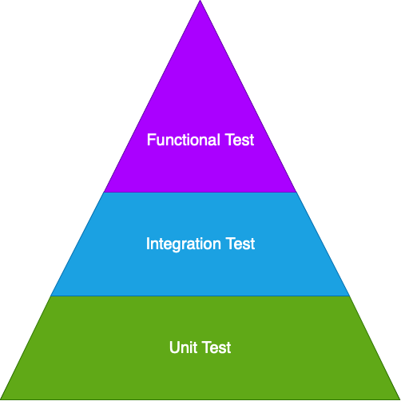
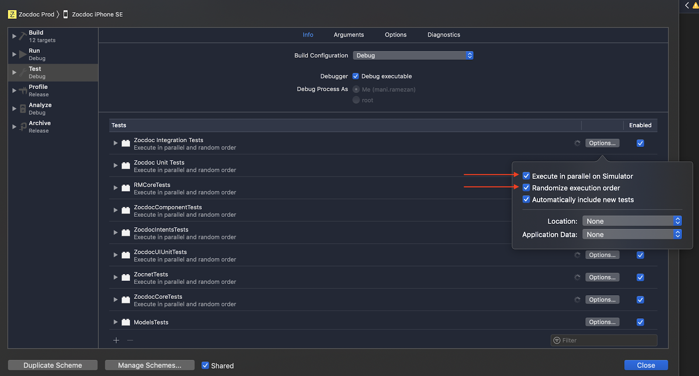
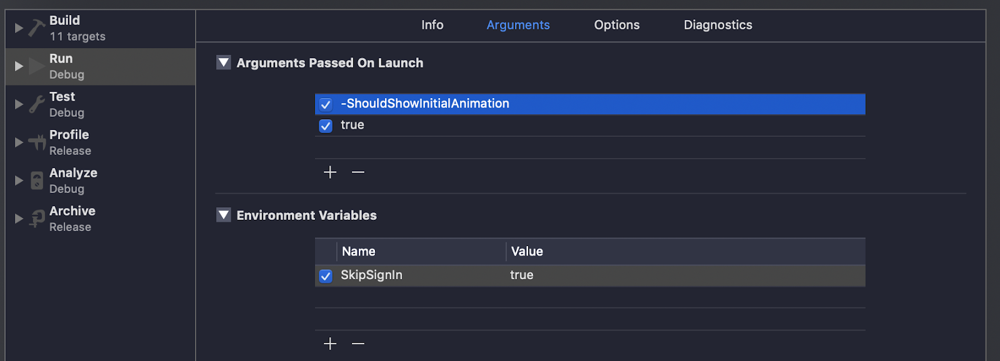
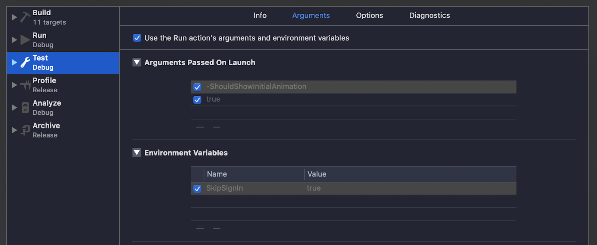

# A little more reliable testing
Writing tests to increase code coverage (test coverage) is generally a good practice. But engineers must also maintain a reasonable velocity of shipping new features. There's no doubt testing increases application quality and prevents bugs, but we need to make careful trade-offs.

Thus, finding the right balance in this trade-off can be tricky. The famous Test Driven-Development (TDD) process highly values tests, yet oftentimes engineers can’t afford to do so due to external factors like impending deadlines or conflicts among various stakeholders. Worse, some companies overlook the type of tests they are writing and only look at simple numbers from code coverage. 

Before explaining how our team at Zocdoc solved this delicate trade-off, let’s review three major types of tests. 

###### Unit test
Unit tests assure that each piece of code (a “unit,” which is a single file in many cases) works as expected independently from other components. At Zocdoc, we have unit tests that confirm something as simple as whether a mocked endpoint returns the expected JSON data. Then, another small unit can parse the JSON response. Using [mock objects](https://en.wikipedia.org/wiki/Mock_object) is common practice when writing unit tests as your test focuses on just one unit of code, assuming all dependencies work as expected.

Unit tests are expected to be deterministic and run in a short amount of time. At Zocdoc, we run these tests on every pull request (PR).

###### Integration test
The next layer in the testing pyramid are integration tests. As shown in the following gif, unit tests confirm that each unit is working individually. Integration tests, on the other hand, confirm multiple units are well orchestrated to work together.

This layer can be tested against production or staging endpoints. Sometimes mock endpoints and mock data are used for integration tests. Tests in this layer may also contain a combination of UI and non-UI tests for major features of the application. For example, signing in with valid credentials, then confirming the user’s expected upcoming appointments are visible. 

Since each test in this layer touches many parts of the code, a single test may significantly increase the code coverage of the application. At Zocdoc, we run integration tests on every PR.

###### Functional Tests (End-to-end tests)
Functional tests, or end-to-end tests, are at the top of the testing pyramid. Their job is to confirm that a changeset works in a simulated production environment. For example, a single test can go through the entire flow of: 

 1. Searching for a dentist in New York  
 2. Selecting one from search result 
 3. Booking the appointment
 4. Confirming the user successfully booked an appointment.

It can be challenging to test in a production environment without tampering with the existing analytics and data. Thus, tests in this layer may take a longer time to finish. At Zocdoc, we run functional tests before every app release.

### Challenges in writing tests in iOS
Next, let’s look at some common challenges of iOS testing and how Zocdoc’s iOS team solved them. 

###### Tightly coupled to application design and architecture
The common pattern in many projects is to start following Apple’s MVC pattern with no [dependency injection](https://en.wikipedia.org/wiki/Dependency_injection) and end up with massive view controllers where writing unit tests becomes tedious.

###### Lack of testing environment
As we mentioned, to safely run tests against a production or staging environment, we should not tamper with production data, for example, by making sure that test requests are not recorded as actual user requests.

###### Running UI tests takes a long time
Depending on the number and types of tests, running all tests can take from several minutes to hours. UI tests especially take quite some time to get into the habit of setting accessibility identifiers and best practices around it. On top of that, flaky (non-deterministic) tests could cause even more headaches.

###### Local ≠ CI
Often, some tests that pass on your machine may fail in the staging environment - the reasons for this vary: different environment variables, dependency versions, or the sequence in which tests run.

###### Code coverage ≠ code quality
Higher code coverage does not necessarily translate into higher code quality. One or two integration tests can make a bigger impact on increasing code coverage than testing every possible edge case with unit tests. While many unit tests may increase the code coverage, it doesn’t guarantee all components will work together. The most effective way to prevent bugs is by having good code coverage ***and*** the right tests.

### Tips and tricks

Now, let’s look at some best practices that have helped our team at Zocdoc overcome these challenges, reduce the maintenance costs of our tests, and made writing robust and reliable tests a breeze:

##### Enable random testing
[Xcode 10](https://developer.apple.com/documentation/xcode_release_notes/xcode_10_release_notes) includes features that allow you to run tests in parallel and randomized order (Look at “Test” section in the project scheme).

Running tests in parallel helps to run tests faster and reduce the wall time for completing them. Based on the hardware that Xcode is running on, it will spin up clones of the selected simulator and run both test bundles on those clones.

Running tests in random order helps to prevent a scenario in which weird test dependencies cause tests to pass only if they are run in a certain order. This, especially, saved us a lot of hours of debugging. These features halved the time tests took to run and doubled the number of fixes.

*For more information, you can check [Building Faster in Xcode](https://developer.apple.com/videos/play/wwdc2018/408/) and [Behind the Scenes of the Xcode Build Process](https://developer.apple.com/videos/play/wwdc2018/415/) sessions from WWDC 2018.*

##### Separate AppDelegate from unit tests

*AppDelegate* is the entry point of each iOS application. It tends to become a place where different third-party SDKs are initialized and many initial setups like notification and deeplink handlings are set. One common task that is run as part of the application launch is initializing Core Data and *NSManagedObjectContext* and persistent stores. Using a SQLite backed store is a common practice for applications, but for unit tests, creating an in-memory store is usually sufficient. 

The solution that we decided to use at Zocdoc is separating unit test *AppDelegate* class from the main application by adding the following code snippet to “main.swift”. This approach gave us the ability to customize only the necessary variables and services required for unit tests inside AppDelegate for unit test bundle and customize features like in-memory CoreData instead of on-disk version. Notice that you need to add “main.swift” to your project if it doesn’t already exist.

    let isRunningTests = NSClassFromString("XCTestCase") != nil
	 let appDelegateClass = isRunningTests ? NSStringFromClass(TestAppDelegate.self) : 	NSStringFromClass(AppDelegate.self)
	UIApplicationMain(CommandLine.argc, CommandLine.unsafeArgv, nil, appDelegateClass)

As a result, we can customize and remove the portions that are not necessary for unit tests and make sure Core Data and other dependencies are initialized and set as tests require.

##### Separate Core Data

Separating Core Data initializations for unit tests and the app is a huge plus because it can help prevent unexpected test failures. This practice also separates the testing-related code from the original application. As a result, the application code remains clean as testing-related code does not become part of the production binary.

Plus, as we started growing our test coverage, we found it very useful to have a dedicated `UITestCase` subclass for only Core Data related unit tests, which includes the helper methods and common scenarios to access core data and managed context.

##### Modularization

When the codebase is broken into smaller modules, each module can have a collection of test bundles. Therefore, writing tests becomes much faster as running test bundles doesn’t require us to build the whole application. 

At Zocdoc, we’ve begun moving toward breaking the code into smaller modules and making a variety of subprojects, each with responsibilities. Getting the dependencies right and making Cocoapods and Carthage play nicely with the new setup took time, but in the end, the amount of time we saved writing tests and running the app justified the investment in effort. 

##### Network stubbing

Depending on the chosen strategy for testing network calls, we need either some form of network stubbing or a supported backend environment that can be customized and used just for testing. Calling actual network endpoints isn't recommended for unit tests because it adds extra latency and the dependency on network availability may cause flakiness in unit tests (Unit tests are probably the last place you want to have flakiness). 

[OHHTTPStubs](https://github.com/AliSoftware/OHHTTPStubs) is a well-known framework for stubbing network calls and responses. It is easy to use and set up, and has many great features such as mocking endpoints and defining custom responses. However, one shortcoming of this framework is that it can’t modify the endpoint responses once it is initialized. For example, this framework cannot be used to to write an integration test to confirm if the app reacts properly to different server sign-in failure error messages. 
One other approach is using `NSURLSession` and `URLProtocol` to mock network layer which was shown in [Testing Tips & Tricks](https://developer.apple.com/videos/play/wwdc2018/417/) session at WWDC 2018.

##### Take advantage of parameters and environment variables

Environment variables and launch arguments can be used to customize some Apple frameworks like defining different levels of logging or enabling debugging options in certain frameworks like Core Data. This technique can also be used to pass information from UI tests to applications and customize behaviors. For example, Arguments Passed On Launch can be used to override UserDefaults values:

Notice the dash before “ShouldShowInitialAnimation” That’s how you can override or pass in arguments that can be received through `UserDefaults`, like:

    let  shouldShowInitialAnimation = UserDefaults.standard.bool(forKey: “ShouldShowInitialAnimation”)
   
Also, these arguments can be set to pass to app when test bundles run:

In addition to using scheme GUI to set these values, these can be set programmatically through `launchArguments` and `launchEnvironment` on `XCUIApplication`.

	app.launchArguments.append("-shouldShowInitialAlert")
	app.launchArguments.append("true")
	app.launchEnvironment["SkipSignIn"] = "\(true)"

In addition to overriding UserDefaults values, this approach can be used to override A/B flags and customize application behavior specifically for each test. We use this technique to override A/B flags or test universal links. For example, we pass in “isAutomatedTest” as a launchArgument when running UI tests to show a touch indicator on screen. This flag can be used with other flags—“openUrl,” for example—to make it easier to test universal links on the simulator as part of test suite.

##### Reset app state

When an application runs, it often asks for the user's permission to access some device services like push notification or location service. The issue arises when multiple UI tests are running in sequence: only the first test shows the modal and the subsequent component—the modal to ask for permission—does not show up. 

This makes writing non-flaky tests hard as it requires each test to know whether or not it is the first one asking for permissions. Also, if one permission is asked in many places in the application, sometimes it is required to test and confirm the flow from all screens. As a result, either the test has to skip testing these scenarios or be written in a way that works for both scenarios.

One way to solve this issue is to reset the application warnings. Doing so assures that each test is set as if the application is asking for permissions for the first time and increases predictability. As a result, the following code snippet is what is run as part of setUp method for UI tests:

	func resetLocationAndPrivacySettings() {
	
	    // Load preferences application https://stackoverflow.com/a/43414750/1450348
	    let preferences = XCUIApplication(bundleIdentifier: "com.apple.Preferences")
	
	    // Needed to make sure it always shows top-level options
	    preferences.terminate()
	    preferences.activate()
	
	
	    //go to `General` -> `Reset` and tap `Reset Location & Privacy`
	    if preferences.tables.staticTexts["General"].exists {
	        preferences.tables.staticTexts["General"].tap()
	    }
	    preferences.tables.staticTexts["Reset"].tap()
	    preferences.tables.staticTexts["Reset Location & Privacy"].tap()
	
	    //tap the `Reset Warnings|Settings` button
	
	    Thread.sleep(forTimeInterval: 0.5)
	
	    #if targetEnvironment(simulator)
	        preferences.buttons["Reset Warnings"].tap()
	    #else
	        settings.buttons["Reset Settings"].tap()
	    #endif
	
	    preferences.terminate()
	}

Notice that in the last line, we terminate the preferences application to reassure that when the next test tries to do the same, it starts from the start page in preferences application. Otherwise, tests following the first one start on the reset screen and can’t use the same steps to reset warnings. Also, notice that the button name for resetting the settings is different between simulator and device.  ¯\\_(ツ)_/¯

Sometimes, it isn’t sufficient to just reset warnings — sometimes the app needs to be deleted to guarantee a clean state with no data remaining from previous tests. One drawback to this approach is the additional time required for each test because removing an application in iOS takes a few seconds. Similar to resetting warnings, the following snippet is run as part of setUp method for each UI tests:

	func deleteAndLaunchApp() {
	
	    app.launch()
	    app.terminate()
	
	    let springboard = XCUIApplication(bundleIdentifier: "com.apple.springboard")
	    let icon = springboard.icons["AppName"]
	    guard icon.exists else {
	        XCTFail("Failed to delete the app. Icon was not found.")
	        return
	    }
	    if #available(iOS 13.0, *) {
	        icon.press(forDuration: 5)
	    } else {
	        icon.press(forDuration: 3)
	    }
	
	    wait(seconds: 1)
	    springboard.buttons.matching(NSPredicate { (element, _) -> Bool in
	        guard let element = element as? XCUIElementAttributes else {
	            return false
	        }
	        return element.frame.intersects(icon.frame)
	    }).element.tap()
	
	    let deleteButton = springboard.alerts.buttons["Delete"]
	    XCTAssertTrue(deleteButton.waitForExistence(timeout: 3))
	    deleteButton.tap()
	    app.launch()
	}
	
	private func wait(seconds timeout: TimeInterval) {
	    let exp = expectation(description: "Idle time expectation")
	    let waiter = XCTWaiter().wait(for: [exp], timeout: timeout)
	    XCTAssert(XCTWaiter.Result.timedOut == waiter, "Wait was interupted")
	}

##### Create a shared library between test bundles

Creating libraries and sharing code across projects isn't just for libraries and applications; it's also useful for writing tests. The following use cases highlight the benefits of this approach:

Creating a library to share accessibility identifiers between UI tests and the main application bundles, and to prevent duplicating them in different places.
Creating a testing library for helper methods and data access layer testings. When the application is broken into several submodules with each having test bundle(s), you will find yourself needing certain logics and helper methods from one test bundle in another. Separating each into a library and sharing them among different unit tests simplifies writing tests and increases quality, in addition to preventing the duplication.

##### Iterate over application design and architecture

If the application suffers from a massive view controller problem, you need to start breaking those view controllers down and making smaller units of code independently testable. This requires significant time and effort, so the best approach is to start gradually and learn from each step. Refactor, break them up, write unit tests, and learn from the experience. Repeat.

### Summary

Writing tests improves code quality and helps with maintenance over time. Covering bug fixes with valid tests ensures any bug doesn't re-occur. Over time, these tests give us more confidence in the code being shipped and can reduce the effort of manual testing required by our developers and the QA team. However, without a proper strategy, writing these tests and maintaining them can be a daunting task. Especially when dealing with deadlines and the need to make that next release. Hopefully, you will find some of the tips presented in this blog helpful.
